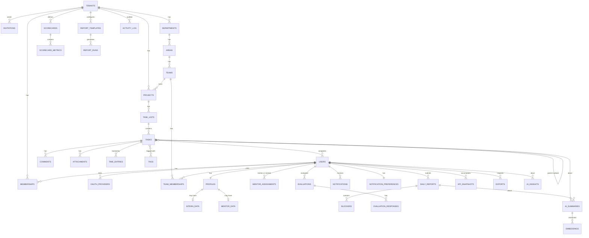

# 08 · Modelo de datos (ERD)

> Fuente de verdad de la estructura relacional. 100% de las tablas del MVP.
> Generar las migraciones directamente desde este documento.
> Convenciones → sección 2. Estrategia de índices → sección 4.

---

## 1. Alcance

Esta es la foto completa del schema del MVP. Cubre los 9 dominios acordados:

1. Identity
2. Organization
3. People
4. Tasks
5. Tracking
6. Notifications
7. Performance (simple)
8. Reports
9. AI

Más las tablas transversales (activity_log, processed_events, spatie permission, Laravel jobs). Total: **~40 tablas**.

Dominios diferidos (Mentorship, Automation, OKRs, Gamification) no están aquí pero se diseñó para añadirlos sin migraciones destructivas.

---

## 2. Convenciones (no negociables)

### 2.1 Columnas estándar en **toda** tabla de dominio

| Columna | Tipo | Null | Default |
|---|---|---|---|
| `id` | `UUID` v7 | no | `gen_random_uuid()` → sobrescrito por app con UUIDv7 para orden temporal |
| `tenant_id` | `UUID` | no | — |
| `created_by` | `UUID` nullable | sí | null (FK a `users.id`) |
| `updated_by` | `UUID` nullable | sí | null |
| `deleted_at` | `TIMESTAMPTZ` | sí | null (soft delete) |
| `created_at` | `TIMESTAMPTZ` | no | `now()` |
| `updated_at` | `TIMESTAMPTZ` | no | `now()` |

**Excepciones explícitas:**
- `tenants` → no tiene `tenant_id` (es el tenant mismo).
- `users` → no tiene `tenant_id` (multi-tenant a través de `memberships`).
- `sessions`, `password_resets`, `personal_access_tokens` → Laravel built-ins (adaptados con `tenant_id` donde aplica).
- `activity_log` → tiene `tenant_id` pero no `deleted_at` (inmutable).
- `processed_events` → tabla técnica sin soft delete.

### 2.2 Foreign keys

- Siempre ON DELETE **RESTRICT** para FKs a `tenants` (no cascadeamos borrado de tenant; se hace en job dedicado).
- ON DELETE **CASCADE** para relaciones de ownership dentro del mismo tenant (ej. `subtasks → tasks`).
- ON DELETE **SET NULL** para referencias opcionales (ej. `tasks.assignee_id → users.id` si el usuario se elimina).

### 2.3 RLS policies

Toda tabla con `tenant_id` lleva:

```sql
ALTER TABLE {table} ENABLE ROW LEVEL SECURITY;
ALTER TABLE {table} FORCE ROW LEVEL SECURITY;
CREATE POLICY tenant_isolation ON {table}
    USING (tenant_id = current_setting('app.tenant_id', true)::uuid);
```

### 2.4 Índices obligatorios

- **Uno compuesto** `(tenant_id, <campo más filtrado>)` como mínimo.
- **Soft delete partial index:** `WHERE deleted_at IS NULL` en índices sobre listados activos.
- **Búsqueda full-text:** GIN sobre `to_tsvector('spanish', ...)` en campos buscables.

### 2.5 Naming

- Tablas en **plural snake_case**: `tasks`, `daily_reports`, `ai_summaries`.
- Tablas pivote alfabéticas: `task_tag`, no `tag_task` ni `tasks_tags`.
- Columnas FK: `{entity}_id` (`user_id`, `project_id`).
- Enums como `VARCHAR(30)` + CHECK constraint (flexibilidad para cambios sin migración de tipo).

### 2.6 Tipos específicos

- Correos: `CITEXT` (case-insensitive, requiere extension).
- Texto corto: `VARCHAR(n)` con límite explícito.
- Texto largo libre: `TEXT`.
- JSON: `JSONB` siempre (no `JSON`).
- Vectores (IA embeddings): `VECTOR(1536)` (pgvector extension, tamaño según modelo).

---

## 3. Diagrama ERD global



---

## 4. Estrategia de índices (resumen de decisiones)

### 4.1 Principios

1. **`tenant_id` primero, siempre.** Sin esto, RLS obliga a scans completos.
2. **Partial indexes** para soft delete: `WHERE deleted_at IS NULL`.
3. **Composite sobre patrones de acceso reales**, no especulativos.
4. **Sorting frecuente** incluido en el índice para evitar sorts externos.
5. **GIN** para JSONB con queries frecuentes y para FTS.
6. **Hash indexes** solo para joins equality puros (no usado en MVP).

### 4.2 Patrones de query esperados y sus índices

| Query típica | Tabla | Índice |
|---|---|---|
| Listar tareas por proyecto en Kanban | `tasks` | `(tenant_id, project_id, state) WHERE deleted_at IS NULL` |
| Mis tareas hoy | `tasks` | `(tenant_id, assignee_id, due_at) WHERE state != 'DONE' AND deleted_at IS NULL` |
| Tareas vencidas (detector cron) | `tasks` | `(tenant_id, due_at) WHERE state NOT IN ('DONE','CANCELLED') AND deleted_at IS NULL` |
| Timeline del practicante | `tasks` | `(tenant_id, assignee_id, created_at DESC)` |
| Búsqueda en tareas | `tasks` | `GIN (to_tsvector('spanish', title || ' ' || coalesce(description,'')))` |
| Reporte diario de un user en fecha | `daily_reports` | `(tenant_id, user_id, report_date)` UNIQUE |
| Notificaciones de un user | `notifications` | `(notifiable_type, notifiable_id, read_at, created_at DESC)` |
| Dashboards por team | `kpi_snapshots` | `(tenant_id, team_id, captured_at DESC)` |
| Evaluaciones próximas | `evaluations` | `(tenant_id, subject_user_id, scheduled_for)` |
| Audit log por entidad | `activity_log` | `(tenant_id, subject_type, subject_id)`, `(tenant_id, created_at DESC)` |
| Buscar embedding similar | `embeddings` | `ivfflat (vector vector_cosine_ops)` lists=100 |

### 4.3 Índices que parecen buenos pero evitamos

- No `INDEX (tenant_id)` solo. Nunca se usa sin al menos otro filtro; solo ocupa disco.
- No `INDEX (created_at)` global sin tenant. Mismo problema.
- No índices sobre columnas que no se filtran ni ordenan nunca (ej. `description` de tarea: buscar sí → GIN, pero no un btree).
- No GIN sobre `JSONB` completo si solo accedemos 2-3 keys específicas. Mejor `INDEX ((settings->>'ai_enabled'))`.

### 4.4 Extensiones Postgres requeridas

```sql
CREATE EXTENSION IF NOT EXISTS "pgcrypto";      -- gen_random_uuid(), crypt
CREATE EXTENSION IF NOT EXISTS "citext";        -- case-insensitive emails
CREATE EXTENSION IF NOT EXISTS "pg_trgm";       -- similarity search
CREATE EXTENSION IF NOT EXISTS "vector";        -- pgvector para IA (si disponible en Railway)
CREATE EXTENSION IF NOT EXISTS "btree_gin";     -- combinar btree + gin en índice
```

**Nota sobre Railway:** pgvector está disponible en Railway Postgres 16+. Verificar antes de correr migrations.

---

## 5. Detalle por dominio

### 5.1 Identity

#### `tenants`

Tabla raíz. No tiene `tenant_id`. Sin RLS.

```
id              UUID PK
slug            VARCHAR(50) UNIQUE NOT NULL     -- acme.interna.app
name            VARCHAR(150) NOT NULL
plan            VARCHAR(30) NOT NULL            -- starter|growth|business|enterprise
status          VARCHAR(20) NOT NULL            -- active|suspended|churned|trialing
settings        JSONB NOT NULL DEFAULT '{}'     -- ai_enabled, gamification_enabled, ...
theme           JSONB NOT NULL DEFAULT '{}'     -- branding tokens
data_residency  VARCHAR(10) NOT NULL DEFAULT 'latam'
stripe_customer_id VARCHAR(50) UNIQUE
trial_ends_at   TIMESTAMPTZ
suspended_at    TIMESTAMPTZ
created_at, updated_at
```

Índices: `UNIQUE(slug)`, `(status)`, `(plan)`, `(stripe_customer_id)`.

#### `users`

Global. Sin `tenant_id`. Pertenece a uno o más tenants vía `memberships`.

```
id                   UUID PK
email                CITEXT UNIQUE NOT NULL
password_hash        VARCHAR(255)             -- null si solo login social
email_verified_at    TIMESTAMPTZ
name                 VARCHAR(150) NOT NULL
avatar_url           TEXT
locale               VARCHAR(10) DEFAULT 'es-MX'
timezone             VARCHAR(50) DEFAULT 'America/Mexico_City'
last_login_at        TIMESTAMPTZ
two_factor_secret    TEXT                     -- cifrado por Laravel
two_factor_recovery_codes TEXT
two_factor_confirmed_at TIMESTAMPTZ
deleted_at, created_at, updated_at
```

Índices: `UNIQUE(email)`, `(last_login_at)` para analytics globales.

#### `memberships`

Relaciona usuarios con tenants. Un user puede estar en N tenants (fase 2), en MVP es 1:1.

```
id              UUID PK
tenant_id       UUID NOT NULL FK
user_id         UUID NOT NULL FK
role            VARCHAR(30) NOT NULL        -- tenant_admin|hr|team_lead|mentor|intern|viewer
status          VARCHAR(20) NOT NULL DEFAULT 'active'  -- active|suspended|removed
invited_by      UUID FK users(id)
joined_at       TIMESTAMPTZ
last_active_at  TIMESTAMPTZ
deleted_at, created_at, updated_at

UNIQUE (tenant_id, user_id)
```

Índices: `(tenant_id, role) WHERE deleted_at IS NULL`, `(user_id)`, `(tenant_id, status)`.

#### `invitations`

```
id              UUID PK
tenant_id       UUID NOT NULL FK
email           CITEXT NOT NULL
token_hash      VARCHAR(64) UNIQUE NOT NULL    -- sha256 del token; nunca guardar plano
role            VARCHAR(30) NOT NULL
team_id         UUID FK teams(id)              -- opcional
mentor_id       UUID FK users(id)              -- asignación pre-cargada
expires_at      TIMESTAMPTZ NOT NULL
accepted_at     TIMESTAMPTZ
accepted_by     UUID FK users(id)
invited_by      UUID NOT NULL FK users(id)
revoked_at      TIMESTAMPTZ
created_at, updated_at
```

Índices: `(tenant_id, email) WHERE accepted_at IS NULL`, `UNIQUE(token_hash)`, `(expires_at) WHERE accepted_at IS NULL`.

#### `oauth_providers`

Vincula un user con una cuenta OAuth externa (Google en MVP).

```
id              UUID PK
user_id         UUID NOT NULL FK users(id)
provider        VARCHAR(30) NOT NULL           -- google|microsoft(f2)|github(f2)
provider_user_id VARCHAR(255) NOT NULL
email           CITEXT
raw_profile     JSONB
created_at, updated_at

UNIQUE (provider, provider_user_id)
```

Índices: `(user_id, provider)`, `UNIQUE (provider, provider_user_id)`.

#### Tablas nativas de Laravel (se crean con migrations oficiales)

- `sessions` (driver de sesión Sanctum stateful) — con `tenant_id` agregado.
- `password_reset_tokens`
- `personal_access_tokens` (Sanctum para integraciones y mobile fase 2)
- `jobs`
- `failed_jobs`

### 5.2 Organization

#### `departments`

```
id              UUID PK
tenant_id       UUID NOT NULL FK
name            VARCHAR(150) NOT NULL
slug            VARCHAR(60) NOT NULL
position        INTEGER DEFAULT 0              -- orden de visualización
metadata        JSONB DEFAULT '{}'
created_by, updated_by, deleted_at, created_at, updated_at

UNIQUE (tenant_id, slug)
```

Índices: `(tenant_id, position)`.

#### `areas`

```
id              UUID PK
tenant_id       UUID NOT NULL FK
department_id   UUID NOT NULL FK departments(id) ON DELETE CASCADE
name            VARCHAR(150) NOT NULL
slug            VARCHAR(60) NOT NULL
position        INTEGER DEFAULT 0
created_by, updated_by, deleted_at, created_at, updated_at

UNIQUE (tenant_id, department_id, slug)
```

#### `teams`

```
id              UUID PK
tenant_id       UUID NOT NULL FK
area_id         UUID NOT NULL FK areas(id) ON DELETE CASCADE
name            VARCHAR(150) NOT NULL
slug            VARCHAR(60) NOT NULL
lead_user_id    UUID FK users(id)
color           VARCHAR(7) DEFAULT '#0891B2'    -- HEX
metadata        JSONB DEFAULT '{}'
created_by, updated_by, deleted_at, created_at, updated_at

UNIQUE (tenant_id, area_id, slug)
```

Índices: `(tenant_id, lead_user_id)`.

#### `team_memberships`

```
id              UUID PK
tenant_id       UUID NOT NULL FK
team_id         UUID NOT NULL FK teams(id) ON DELETE CASCADE
user_id         UUID NOT NULL FK users(id)
role            VARCHAR(30) NOT NULL            -- lead|mentor|intern|viewer
joined_at       TIMESTAMPTZ NOT NULL DEFAULT now()
left_at         TIMESTAMPTZ
created_at, updated_at

UNIQUE (team_id, user_id) WHERE left_at IS NULL
```

Índices: `(tenant_id, user_id) WHERE left_at IS NULL`, `(team_id, role)`.

### 5.3 People

#### `profiles`

Extensión 1:1 de `users` con datos contextualizados al tenant (un user que esté en 2 tenants podría tener 2 profiles).

```
id                  UUID PK
tenant_id           UUID NOT NULL FK
user_id             UUID NOT NULL FK users(id) ON DELETE CASCADE
bio                 TEXT
phone               VARCHAR(255)               -- cifrado (app-level)
national_id         VARCHAR(255)               -- cifrado
birth_date          DATE                       -- considerar cifrar
position_title      VARCHAR(150)
start_date          DATE
end_date            DATE
kind                VARCHAR(20) NOT NULL       -- intern|mentor|staff
skills              JSONB DEFAULT '[]'         -- ['figma','react']
social_links        JSONB DEFAULT '{}'         -- {linkedin, github}
emergency_contact   JSONB DEFAULT '{}'
deleted_at, created_at, updated_at, created_by, updated_by

UNIQUE (tenant_id, user_id)
```

Índices: `(tenant_id, kind)`, `(tenant_id, user_id)` unique.

#### `intern_data`

Datos específicos de practicantes. 0..1 por profile.

```
id                  UUID PK
tenant_id           UUID NOT NULL FK
profile_id          UUID NOT NULL FK profiles(id) ON DELETE CASCADE
university          VARCHAR(200)
career              VARCHAR(150)
semester            SMALLINT CHECK (semester BETWEEN 1 AND 20)
mandatory_hours     INTEGER                    -- horas totales exigidas por convenio
hours_completed     INTEGER DEFAULT 0
university_advisor  VARCHAR(200)               -- nombre del tutor académico
university_email    CITEXT
gpa                 DECIMAL(3,2)
created_at, updated_at

UNIQUE (profile_id)
```

Índices: `(tenant_id, university)` para reportes por universidad.

#### `mentor_data`

```
id                  UUID PK
tenant_id           UUID NOT NULL FK
profile_id          UUID NOT NULL FK profiles(id) ON DELETE CASCADE
expertise           JSONB DEFAULT '[]'          -- ['ui','design-systems']
max_mentees         SMALLINT DEFAULT 5
availability        JSONB DEFAULT '{}'          -- {mon: '09:00-12:00', ...}
certified_at        TIMESTAMPTZ                 -- fase 2 programa mentores
created_at, updated_at

UNIQUE (profile_id)
```

#### `mentor_assignments`

Un mentor ↔ un practicante, con periodo.

```
id              UUID PK
tenant_id       UUID NOT NULL FK
mentor_user_id  UUID NOT NULL FK users(id)
intern_user_id  UUID NOT NULL FK users(id)
started_at      TIMESTAMPTZ NOT NULL DEFAULT now()
ended_at        TIMESTAMPTZ
status          VARCHAR(20) NOT NULL DEFAULT 'active'  -- active|ended|paused
notes           TEXT
created_at, updated_at, created_by
```

Índices: `(tenant_id, intern_user_id) WHERE status='active'` único; `(tenant_id, mentor_user_id, status)`.

### 5.4 Shared (atraviesa dominios)

#### `activity_log` (Spatie-style + tenant-aware + inmutable)

Ya especificado en `03-security.md` sección 9. Recapitulando:

```
id            UUID PK
tenant_id     UUID NOT NULL
log_name      VARCHAR(50)
description   TEXT
subject_type  VARCHAR(100)
subject_id    UUID
causer_type   VARCHAR(100)
causer_id     UUID
event         VARCHAR(50)
properties    JSONB
ip_address    INET
user_agent    TEXT
request_id    VARCHAR(36)
created_at    TIMESTAMPTZ NOT NULL DEFAULT now()
```

Revocar UPDATE/DELETE del rol `interna_app` tras crear la tabla.

#### `processed_events`

Idempotencia para listeners.

```
id            BIGSERIAL PK        -- aquí sí serial, es interno
event_id      UUID NOT NULL
handler       VARCHAR(100) NOT NULL
tenant_id     UUID
processed_at  TIMESTAMPTZ NOT NULL DEFAULT now()

UNIQUE (event_id, handler)
```

Partición por mes (pg_partman) en fase 1 cuando crezca. TTL: purga >90 días.

#### Tablas de Spatie Permission (auto-generadas por el package)

- `permissions`: `id, name, guard_name, created_at, updated_at`
- `roles`: `id, name, guard_name, tenant_id (via teams mode), created_at, updated_at`
- `model_has_permissions`, `model_has_roles`, `role_has_permissions`: pivot tables con `tenant_id` a través de teams mode de Spatie.

### 5.5 Tasks

#### `projects`

```
id                  UUID PK
tenant_id           UUID NOT NULL FK
team_id             UUID NOT NULL FK teams(id)
name                VARCHAR(200) NOT NULL
slug                VARCHAR(100) NOT NULL
description         TEXT
status              VARCHAR(20) DEFAULT 'active'    -- active|paused|archived|completed
color               VARCHAR(7)
cover_url           TEXT
start_date          DATE
end_date            DATE
metadata            JSONB DEFAULT '{}'
archived_at         TIMESTAMPTZ
deleted_at, created_at, updated_at, created_by, updated_by

UNIQUE (tenant_id, slug)
```

Índices: `(tenant_id, team_id, status)`, `(tenant_id, status) WHERE deleted_at IS NULL`.

#### `task_lists`

```
id              UUID PK
tenant_id       UUID NOT NULL FK
project_id      UUID NOT NULL FK projects(id) ON DELETE CASCADE
name            VARCHAR(150) NOT NULL
position        INTEGER NOT NULL DEFAULT 0
color           VARCHAR(7)
wip_limit       INTEGER                         -- nullable, límite Kanban
deleted_at, created_at, updated_at, created_by, updated_by
```

Índices: `(tenant_id, project_id, position) WHERE deleted_at IS NULL`.

#### `tasks`

La tabla más densa. Es central para el producto.

```
id                  UUID PK
tenant_id           UUID NOT NULL FK
project_id          UUID NOT NULL FK projects(id) ON DELETE CASCADE
list_id             UUID FK task_lists(id) ON DELETE SET NULL
parent_task_id      UUID FK tasks(id) ON DELETE CASCADE   -- subtarea si != null
title               VARCHAR(300) NOT NULL
description         TEXT                                   -- markdown (sanitizado en app)
state               VARCHAR(30) NOT NULL DEFAULT 'TO_DO'   -- BACKLOG|TO_DO|IN_PROGRESS|IN_REVIEW|DONE|BLOCKED|CANCELLED
priority            VARCHAR(20) NOT NULL DEFAULT 'normal'  -- urgent|high|normal|low
assignee_id         UUID FK users(id) ON DELETE SET NULL
reviewer_id         UUID FK users(id) ON DELETE SET NULL
due_at              TIMESTAMPTZ
estimated_minutes   INTEGER                                -- estimación
actual_minutes      INTEGER DEFAULT 0                      -- total de time_entries agregado
position            INTEGER NOT NULL DEFAULT 0             -- orden dentro de la lista
blocked_reason      TEXT                                   -- si state=BLOCKED
started_at          TIMESTAMPTZ                            -- cuando pasó a IN_PROGRESS la primera vez
completed_at        TIMESTAMPTZ                            -- cuando pasó a DONE
cancelled_at        TIMESTAMPTZ
metadata            JSONB DEFAULT '{}'
deleted_at, created_at, updated_at, created_by, updated_by

CHECK (state IN ('BACKLOG','TO_DO','IN_PROGRESS','IN_REVIEW','DONE','BLOCKED','CANCELLED'))
CHECK (priority IN ('urgent','high','normal','low'))
```

Índices (críticos):
- `(tenant_id, project_id, state, position) WHERE deleted_at IS NULL`
- `(tenant_id, assignee_id, due_at) WHERE state NOT IN ('DONE','CANCELLED') AND deleted_at IS NULL`
- `(tenant_id, due_at) WHERE state NOT IN ('DONE','CANCELLED') AND deleted_at IS NULL`
- `(tenant_id, parent_task_id)` para cargar subtareas
- `GIN (to_tsvector('spanish', title || ' ' || coalesce(description,'')))`

#### `task_assignees` (many-to-many, para multi-asignación fase 2)

MVP acepta `assignee_id` directo en `tasks`. Añadimos tabla pivote para cuando necesitemos múltiples:

```
task_id         UUID FK tasks(id) ON DELETE CASCADE
user_id         UUID FK users(id) ON DELETE CASCADE
tenant_id       UUID NOT NULL FK
role            VARCHAR(20) DEFAULT 'assignee'   -- assignee|reviewer|watcher
assigned_at     TIMESTAMPTZ NOT NULL DEFAULT now()
assigned_by     UUID FK users(id)

PRIMARY KEY (task_id, user_id, role)
```

Índices: `(tenant_id, user_id, role)`.

#### `comments`

Polimórfico (puede comentar sobre `tasks`, fase 2 sobre `evaluations`).

```
id                  UUID PK
tenant_id           UUID NOT NULL FK
commentable_type    VARCHAR(100) NOT NULL      -- 'App\\Modules\\Tasks\\Domain\\Task'
commentable_id      UUID NOT NULL
author_id           UUID NOT NULL FK users(id)
body                TEXT NOT NULL              -- markdown
mentions            JSONB DEFAULT '[]'         -- [user_id, ...]
parent_comment_id   UUID FK comments(id) ON DELETE CASCADE
edited_at           TIMESTAMPTZ
deleted_at, created_at, updated_at
```

Índices: `(tenant_id, commentable_type, commentable_id, created_at DESC) WHERE deleted_at IS NULL`.

#### `attachments`

Polimórfico, metadata de archivos en R2.

```
id              UUID PK
tenant_id       UUID NOT NULL FK
attachable_type VARCHAR(100) NOT NULL
attachable_id   UUID NOT NULL
uploaded_by     UUID NOT NULL FK users(id)
original_name   VARCHAR(255) NOT NULL
stored_key      VARCHAR(500) NOT NULL          -- path en R2
mime_type       VARCHAR(100) NOT NULL
size_bytes      BIGINT NOT NULL
checksum_sha256 CHAR(64)
metadata        JSONB DEFAULT '{}'             -- dimensions, duration, etc.
deleted_at, created_at, updated_at
```

Índices: `(tenant_id, attachable_type, attachable_id)`, `(tenant_id, uploaded_by)`.

#### `time_entries`

Registro de tiempo por tarea.

```
id              UUID PK
tenant_id       UUID NOT NULL FK
task_id         UUID NOT NULL FK tasks(id) ON DELETE CASCADE
user_id         UUID NOT NULL FK users(id)
started_at      TIMESTAMPTZ NOT NULL
ended_at        TIMESTAMPTZ
duration_minutes INTEGER                        -- computado al cerrar
note            TEXT
source          VARCHAR(20) DEFAULT 'timer'     -- timer|manual|auto
created_at, updated_at

CHECK (ended_at IS NULL OR ended_at >= started_at)
```

Índices: `(tenant_id, user_id, started_at DESC)`, `(tenant_id, task_id)`.

#### `tags` + `task_tag`

```
tags:
    id, tenant_id, name, slug, color, created_at, updated_at
    UNIQUE (tenant_id, slug)

task_tag:
    task_id FK, tag_id FK, tenant_id, created_at
    PRIMARY KEY (task_id, tag_id)
```

### 5.6 Tracking

#### `daily_reports`

```
id                  UUID PK
tenant_id           UUID NOT NULL FK
user_id             UUID NOT NULL FK users(id)
report_date         DATE NOT NULL
status              VARCHAR(20) DEFAULT 'submitted'   -- draft|submitted|reviewed
progress_summary    TEXT NOT NULL                     -- "qué avancé"
blockers_text       TEXT                              -- "qué me bloqueó" (texto libre)
plan_tomorrow       TEXT                              -- "qué haré mañana"
mood                VARCHAR(20)                       -- great|good|ok|stressed|blocked
hours_worked        DECIMAL(4,2)
ai_summary_id       UUID FK ai_summaries(id)          -- resumen IA asociado
submitted_at        TIMESTAMPTZ
reviewed_by         UUID FK users(id)
reviewed_at         TIMESTAMPTZ
deleted_at, created_at, updated_at

UNIQUE (tenant_id, user_id, report_date)
```

Índices: `(tenant_id, user_id, report_date DESC)`, `(tenant_id, report_date)` para agregados.

#### `blockers`

Registro estructurado de bloqueos, con lifecycle propio.

```
id              UUID PK
tenant_id       UUID NOT NULL FK
raised_by       UUID NOT NULL FK users(id)
related_task_id UUID FK tasks(id) ON DELETE SET NULL
daily_report_id UUID FK daily_reports(id) ON DELETE CASCADE
title           VARCHAR(200) NOT NULL
description     TEXT
severity        VARCHAR(20) DEFAULT 'medium'    -- low|medium|high|critical
status          VARCHAR(20) DEFAULT 'open'      -- open|acknowledged|resolved|dismissed
resolved_at     TIMESTAMPTZ
resolution      TEXT
resolved_by     UUID FK users(id)
deleted_at, created_at, updated_at
```

Índices: `(tenant_id, status) WHERE status='open'`, `(tenant_id, raised_by)`.

### 5.7 Notifications

#### `notifications` (Laravel nativo + tenant_id)

```
id              UUID PK                -- Laravel default
type            VARCHAR(150) NOT NULL  -- class name
tenant_id       UUID FK                -- añadido para tenancy
notifiable_type VARCHAR(100) NOT NULL
notifiable_id   UUID NOT NULL
data            JSONB NOT NULL
read_at         TIMESTAMPTZ
created_at, updated_at
```

Índices: `(notifiable_type, notifiable_id, read_at, created_at DESC)`, `(tenant_id, created_at DESC)`.

#### `notification_preferences`

Una fila por user con sus preferencias por canal y categoría.

```
id              UUID PK
tenant_id       UUID NOT NULL FK
user_id         UUID NOT NULL FK users(id) ON DELETE CASCADE
channel         VARCHAR(20) NOT NULL   -- in_app|email|push
category        VARCHAR(50) NOT NULL   -- task_assigned|mention|blocker|evaluation|digest
enabled         BOOLEAN NOT NULL DEFAULT true
frequency       VARCHAR(20) DEFAULT 'immediate'  -- immediate|hourly|daily
quiet_hours     JSONB                  -- {start:'22:00', end:'08:00'}
updated_at, created_at

UNIQUE (tenant_id, user_id, channel, category)
```

### 5.8 Performance

#### `scorecards`

Plantillas de evaluación con métricas.

```
id              UUID PK
tenant_id       UUID NOT NULL FK
name            VARCHAR(150) NOT NULL
description     TEXT
applicable_to   VARCHAR(20) DEFAULT 'intern'   -- intern|mentor|staff
is_active       BOOLEAN DEFAULT true
deleted_at, created_at, updated_at, created_by, updated_by
```

#### `scorecard_metrics`

```
id              UUID PK
tenant_id       UUID NOT NULL FK
scorecard_id    UUID NOT NULL FK scorecards(id) ON DELETE CASCADE
key             VARCHAR(60) NOT NULL          -- tasks_on_time|avg_review_score|...
label           VARCHAR(150) NOT NULL
type            VARCHAR(20) NOT NULL          -- auto|manual|likert|rubric
source          VARCHAR(60)                   -- tasks|reviews|manual
target_value    DECIMAL(10,2)
unit            VARCHAR(20)                   -- percent|score|hours
weight          DECIMAL(4,2) DEFAULT 1.0
config          JSONB DEFAULT '{}'            -- para rubricas, likert labels, etc.
position        INTEGER DEFAULT 0

UNIQUE (scorecard_id, key)
```

#### `evaluations`

```
id                  UUID PK
tenant_id           UUID NOT NULL FK
scorecard_id        UUID NOT NULL FK scorecards(id)
subject_user_id     UUID NOT NULL FK users(id)  -- el evaluado
evaluator_user_id   UUID FK users(id)
kind                VARCHAR(20) NOT NULL        -- 30d|60d|90d|adhoc|360
scheduled_for       DATE
started_at          TIMESTAMPTZ
submitted_at        TIMESTAMPTZ
signed_at           TIMESTAMPTZ
acknowledged_at     TIMESTAMPTZ
status              VARCHAR(20) DEFAULT 'SCHEDULED'   -- SCHEDULED|IN_PROGRESS|SUBMITTED|ACKNOWLEDGED|DISPUTED|RESOLVED|CANCELLED
overall_score       DECIMAL(4,2)
narrative           TEXT
ai_draft_narrative  TEXT                        -- sugerido por IA
deleted_at, created_at, updated_at, created_by, updated_by
```

Índices: `(tenant_id, subject_user_id, scheduled_for)`, `(tenant_id, status, scheduled_for)`, `(tenant_id, evaluator_user_id, status)`.

#### `evaluation_responses`

Una fila por métrica evaluada.

```
id              UUID PK
tenant_id       UUID NOT NULL FK
evaluation_id   UUID NOT NULL FK evaluations(id) ON DELETE CASCADE
metric_id       UUID NOT NULL FK scorecard_metrics(id)
value_numeric   DECIMAL(10,2)
value_text      TEXT
value_json      JSONB
auto_value      DECIMAL(10,2)                   -- valor auto-calculado
created_at, updated_at

UNIQUE (evaluation_id, metric_id)
```

#### `kpi_snapshots`

Métricas agregadas por user/team/período. Pre-computed para dashboards.

```
id              UUID PK
tenant_id       UUID NOT NULL FK
subject_type    VARCHAR(30) NOT NULL          -- user|team|department
subject_id      UUID NOT NULL
metric_key      VARCHAR(60) NOT NULL          -- tasks_on_time|hours_logged|...
period          VARCHAR(20) NOT NULL          -- day|week|month|quarter
period_start    DATE NOT NULL
period_end      DATE NOT NULL
value           DECIMAL(12,4) NOT NULL
sample_size     INTEGER
computed_at     TIMESTAMPTZ NOT NULL DEFAULT now()

UNIQUE (tenant_id, subject_type, subject_id, metric_key, period, period_start)
```

Índices: `(tenant_id, subject_type, subject_id, metric_key, period_start DESC)`, `(tenant_id, period, period_start)`.

### 5.9 Reports

#### `report_templates`

```
id              UUID PK
tenant_id       UUID NOT NULL FK
kind            VARCHAR(30) NOT NULL            -- university|executive|team|custom
name            VARCHAR(150) NOT NULL
config          JSONB NOT NULL                  -- campos incluidos, filtros
layout          VARCHAR(50) DEFAULT 'default'   -- nombre de Blade view a usar
is_system       BOOLEAN DEFAULT false           -- template pre-cargado vs. del tenant
deleted_at, created_at, updated_at, created_by
```

#### `report_runs`

Instancia generada de un template.

```
id                  UUID PK
tenant_id           UUID NOT NULL FK
template_id         UUID NOT NULL FK report_templates(id)
requested_by        UUID NOT NULL FK users(id)
subject_type        VARCHAR(30)                 -- user|team|tenant
subject_id          UUID
period_start        DATE
period_end          DATE
parameters          JSONB
status              VARCHAR(20) DEFAULT 'queued'  -- queued|running|completed|failed
file_key            VARCHAR(500)                -- path en R2 si completed
file_size_bytes     BIGINT
error_message       TEXT
started_at          TIMESTAMPTZ
completed_at        TIMESTAMPTZ
expires_at          TIMESTAMPTZ                 -- TTL del PDF en R2
created_at, updated_at
```

Índices: `(tenant_id, status, created_at DESC)`, `(tenant_id, requested_by)`, `(expires_at) WHERE file_key IS NOT NULL`.

#### `exports`

Exportaciones genéricas (CSV, JSON) distintas de PDF report.

```
id              UUID PK
tenant_id       UUID NOT NULL FK
requested_by    UUID NOT NULL FK users(id)
resource        VARCHAR(50) NOT NULL            -- tasks|users|evaluations
format          VARCHAR(10) NOT NULL            -- csv|json|xlsx
filters         JSONB
status          VARCHAR(20) DEFAULT 'queued'
file_key        VARCHAR(500)
row_count       INTEGER
completed_at    TIMESTAMPTZ
expires_at      TIMESTAMPTZ
created_at, updated_at
```

### 5.10 AI

#### `ai_summaries`

Generated summaries guardados (daily report, task, evaluation, etc.).

```
id                  UUID PK
tenant_id           UUID NOT NULL FK
subject_type        VARCHAR(100) NOT NULL
subject_id          UUID NOT NULL
kind                VARCHAR(30) NOT NULL          -- daily|weekly|task|evaluation
model               VARCHAR(50) NOT NULL          -- claude-sonnet-4-6|claude-haiku-4-5
prompt_tokens       INTEGER
completion_tokens   INTEGER
cost_usd            DECIMAL(8,4)
content             TEXT NOT NULL
approved_at         TIMESTAMPTZ                   -- user approved/edited
approved_by         UUID FK users(id)
created_at
```

Índices: `(tenant_id, subject_type, subject_id, kind)`, `(tenant_id, created_at)`.

#### `ai_insights`

Insights detectados (riesgo, patrones).

```
id              UUID PK
tenant_id       UUID NOT NULL FK
subject_type    VARCHAR(100) NOT NULL
subject_id      UUID NOT NULL
kind            VARCHAR(40) NOT NULL             -- risk_of_delay|pattern_blocked|low_activity|standout
severity        VARCHAR(20) NOT NULL             -- info|warning|critical
title           VARCHAR(200) NOT NULL
description     TEXT
evidence        JSONB                            -- qué datos lo soportan
confidence      DECIMAL(4,3)                     -- 0.000 a 1.000
dismissed_at    TIMESTAMPTZ
dismissed_by    UUID FK users(id)
acknowledged_at TIMESTAMPTZ
acknowledged_by UUID FK users(id)
resolved_at     TIMESTAMPTZ
created_at, updated_at
```

Índices: `(tenant_id, subject_type, subject_id, dismissed_at) WHERE dismissed_at IS NULL`, `(tenant_id, severity, created_at DESC)`.

#### `ai_request_log`

Auditoría técnica de cada llamada a la API.

```
id                  BIGSERIAL PK       -- alto volumen, serial OK
tenant_id           UUID NOT NULL
user_id             UUID FK users(id)
model               VARCHAR(50)
kind                VARCHAR(30)
prompt_tokens       INTEGER
completion_tokens   INTEGER
cost_usd            DECIMAL(8,4)
latency_ms          INTEGER
status              VARCHAR(20)         -- success|error|rate_limited|cached
cache_hit           BOOLEAN DEFAULT false
error_message       TEXT
created_at          TIMESTAMPTZ NOT NULL DEFAULT now()
```

Particionar por mes en fase 1. Retención 12 meses.

Índices: `(tenant_id, created_at DESC)`, `(status, created_at DESC)`.

#### `embeddings`

pgvector. Un embedding por pieza de contenido (task description, daily report, evaluation narrative) que queremos recuperar semánticamente.

```
id              UUID PK
tenant_id       UUID NOT NULL
subject_type    VARCHAR(100) NOT NULL
subject_id      UUID NOT NULL
source_field    VARCHAR(50)                    -- 'description'|'narrative'|...
content_hash    CHAR(64) NOT NULL              -- sha256 del contenido vectorizado
vector          VECTOR(1536) NOT NULL          -- dimensión según modelo Anthropic/Voyage
model           VARCHAR(50) NOT NULL
created_at

UNIQUE (tenant_id, subject_type, subject_id, source_field)
```

Índices:
- `(tenant_id, subject_type, subject_id)` para lookup por entidad
- `IVFFLAT (vector vector_cosine_ops) WITH (lists = 100)` para nearest neighbor search

---

## 6. Orden de migraciones

Las FKs exigen un orden específico. Este es el orden (timestamp de migration nombrado acorde):

```
2026_04_22_000001  install_extensions                       (pgcrypto, citext, vector, pg_trgm)
2026_04_22_000010  create_tenants
2026_04_22_000020  create_users
2026_04_22_000030  create_password_reset_tokens
2026_04_22_000031  create_sessions
2026_04_22_000032  create_personal_access_tokens_table
2026_04_22_000040  create_memberships
2026_04_22_000041  create_invitations
2026_04_22_000042  create_oauth_providers
2026_04_22_000050  create_jobs_table
2026_04_22_000051  create_failed_jobs_table
2026_04_22_000060  create_permission_tables                 (spatie package migration)
2026_04_22_000070  create_activity_log_table                (spatie)
2026_04_22_000071  adjust_activity_log_for_tenant_and_immutable
2026_04_22_000072  create_processed_events
2026_04_22_000080  create_departments
2026_04_22_000081  create_areas
2026_04_22_000082  create_teams
2026_04_22_000083  create_team_memberships
2026_04_22_000090  create_profiles
2026_04_22_000091  create_intern_data
2026_04_22_000092  create_mentor_data
2026_04_22_000093  create_mentor_assignments
2026_04_22_000100  create_projects
2026_04_22_000101  create_task_lists
2026_04_22_000102  create_tasks
2026_04_22_000103  create_task_assignees
2026_04_22_000104  create_tags
2026_04_22_000105  create_task_tag
2026_04_22_000106  create_comments
2026_04_22_000107  create_attachments
2026_04_22_000108  create_time_entries
2026_04_22_000110  create_daily_reports
2026_04_22_000111  create_blockers
2026_04_22_000120  create_notifications_table               (Laravel notifications)
2026_04_22_000121  adjust_notifications_for_tenant
2026_04_22_000122  create_notification_preferences
2026_04_22_000130  create_scorecards
2026_04_22_000131  create_scorecard_metrics
2026_04_22_000132  create_evaluations
2026_04_22_000133  create_evaluation_responses
2026_04_22_000134  create_kpi_snapshots
2026_04_22_000140  create_report_templates
2026_04_22_000141  create_report_runs
2026_04_22_000142  create_exports
2026_04_22_000150  create_ai_summaries
2026_04_22_000151  create_ai_insights
2026_04_22_000152  create_ai_request_log
2026_04_22_000153  create_embeddings
2026_04_22_000160  enable_rls_all_tables                     (policy batch)
2026_04_22_000161  revoke_update_delete_on_immutable_tables
```

---

## 7. Validación antes de correr migrations en prod

- [ ] Todas las tablas de dominio tienen `tenant_id NOT NULL`.
- [ ] Todas las tablas con `tenant_id` tienen RLS `ENABLE` + `FORCE` + policy `tenant_isolation`.
- [ ] Índice compuesto `(tenant_id, ...)` en cada tabla.
- [ ] FKs con ON DELETE apropiado documentado.
- [ ] UNIQUEs con scope tenant donde aplica (`UNIQUE (tenant_id, slug)` no solo `UNIQUE (slug)`).
- [ ] Extensiones creadas antes que las tablas que las usan.
- [ ] Tests de aislamiento (`tests/Feature/TenantIsolationTest.php`) pasan contra este schema.
- [ ] `EXPLAIN ANALYZE` de las 10 queries más frecuentes no muestra Seq Scan.
